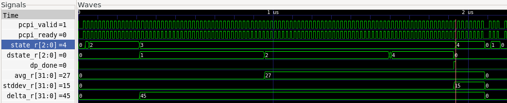

# SMACC: Statistical Math Accelerator for RISC-V

A custom RISC-V instruction-set extension and coprocessor that computes
streaming statistics (**min, max, count, average, standard deviation, and
range**) over 32-bit data, attached to a [PicoRV32](https://github.com/YosysHQ/picorv32)
core through its PCPI coprocessor interface.

SMACC started as a university System-on-Chip course project and has been
reworked steadily since. The current revision replaces the original
pipelined design with bit-serial arithmetic, a non-stalling instruction
protocol, and an assertion-based test suite, and lands at about **one
sixth of the original gate count**.

## Why a Coprocessor?

Accumulating one sample in software costs tens to hundreds of cycles on a
small core (compare-and-update min/max, a 64-bit running sum, and, without
the M extension, a software multiply for the sum of squares). SMACC does
all of it in **one custom instruction per sample**, then computes the
divide/square-root statistics in a background engine while the CPU keeps
running.

## Instruction Set

All four instructions live in the RISC-V *custom-0* opcode space (`0x0B`),
selected by `funct3`; see [docs/ISA_SPEC.md](docs/ISA_SPEC.md) for
bit-level encodings:

| Instruction | Action                                                            |
|-------------|-------------------------------------------------------------------|
| `START`     | Clear all state, begin a new run                                  |
| `DATA rs1`  | Accumulate one 32-bit sample (single cycle)                       |
| `STOP`      | Kick off avg/stddev/delta finalization (returns immediately)      |
| `READ rd,n` | Read statistic *n* as a full 32-bit value                         |

`STOP` never stalls the CPU: a fixed 162-cycle engine computes the derived
statistics in the background, and software polls a status flag (or does
other work) before reading them. Until then those reads return 0, so stale or
in-flight values can never be read back.

## Architecture

```plaintext
  ┌──────────┐     PCPI bus      ┌───────────────────────────────┐
  │ PicoRV32 │ <===============> │           smacc_top           │
  │  (CPU)   │                   │  (decodes the 4 custom-0 ops, │
  └──────────┘                   │ muxes the 32-bit READ result) │
                                 └───────────────┬───────────────┘
                                                 │  routes each op to:
           ┌─────────────────────────────────────┼────────────────────────────────────────┐
           V                                     V                                        V
  ┌──────────────────┐                  ┌──────────────────┐                  ┌─────────────────────┐
  │    smacc_ctrl    │                  │    smacc_mem     │                  │   smacc_datapath    │
  │ (control / FSM)  │                  │(live statistics) │                  │ (heavy math engine) │
  ├──────────────────┤                  ├──────────────────┤                  ├─────────────────────┤
  │ 5-state FSM,     │                  │ min, max, count  │                  │ runs after STOP:    │
  │ status byte,     │                  │ sum, sum_sq      │                  │ 2 divides, 1 square │
  │ sticky error,    │                  │ 64-bit, updated  │                  │ + isqrt, bit-serial │
  │ tracking         │                  │ in 1 cycle/DATA  │                  │ 1 divider, 162 cyc  │
  └──────────────────┘                  └──────────────────┘                  └─────────────────────┘
   tracks what state                     holds the running                    computes the derived
   the engine is in                      stats as data arrives                stats (avg/stddev/delta)
```

Design choices worth a look (rationale in
[docs/DATAPATH_DESIGN.md](docs/DATAPATH_DESIGN.md)):

- **One multiplier in the whole design.** The divides and square root are
  bit-serial; avg^2 is computed by a shift-add squarer that runs *in
  parallel with* the second divide, costing zero extra latency. Only the
  sum-of-squares multiplier remains combinational (the ISA promises
  single-cycle DATA), and it is operand-isolated to stop it burning power
  on non-DATA instructions.
- **Saturate, never wrap.** Accumulator overflow saturates and raises a
  sticky error flag; count and average readouts clamp at 2^32-1. Overflow
  detection is the carry-out of the accumulate adder itself, so no extra
  comparators are needed.
- **Results gated by FSM state.** Derived statistics are muxed to 0 except
  in the DONE state, so aborted or half-finished computations can't leak.
- Warning-clean under Verilator `-Wall`; all-synchronous reset; zero
  inferred latches.

## Quick Start

Requires [Verilator](https://verilator.org) >= 5.0 (and optionally
[Yosys](https://yosyshq.net/yosys/) + GTKWave):

```sh
bash scripts/run_tests.sh           # lint + run all 13 test groups (78 checks)
bash scripts/run_tests.sh --wave    # same, plus smacc_tb.vcd for GTKWave
yosys -s scripts/synth.ys           # synthesis sanity check + area report
```

## Using it from C

[`sw/smacc.h`](sw/smacc.h) wraps the custom instructions with `.insn`
directives, so the stock riscv32 GCC toolchain works without any assembler patches:

```c
#include "smacc.h"

smacc_start();
for (uint32_t i = 0; i < n; i++)
    smacc_data(samples[i]);
smacc_stop();                       /* returns immediately */
smacc_wait_done();                  /* ~162 cycles; or poll smacc_status() */

uint32_t avg    = smacc_read_avg();
uint32_t stddev = smacc_read_stddev();
```

A complete example lives in [`sw/example.c`](sw/example.c); it compiles
clean with `riscv64-unknown-elf-gcc -march=rv32i -mabi=ilp32`, and the
disassembly matches the ISA encoding table word for word (see
[docs/VERIFICATION.md](docs/VERIFICATION.md)).
[`smacc_system.sv`](src/rtl/smacc_system.sv) wires the accelerator to a
PicoRV32 for full-system use.

## Verification and Results

The self-checking testbench drives the PCPI bus directly; every expected
value is hand-derived in an adjacent comment. SystemVerilog assertions
guard the FSM, the PCPI handshake, and the divider invariant from inside
the design. Full test plan and transcript:
[docs/VERIFICATION.md](docs/VERIFICATION.md).

The waveform below, captured in GTKWave around test T1's STOP, shows the
headline behavior: STOP acknowledges immediately, the engine works for 162
cycles while the CPU keeps issuing status polls, and the results (delta=45,
avg=27, stddev=15) settle before the FSM reaches DONE. State values follow
the enums in the RTL: `state_r` 2=ACCUMULATE, 3=FINALIZING, 4=DONE;
`dstate_r` 1=DIV1, 2=DIV2, 4=SQRT.



Inputs cover the full range: zeros, the 2^32-1 maximum, deliberate
accumulator overflow, and seeded random data checked against an
independent software model. An excerpt:

```plaintext
-- T12: sum-of-squares overflow --
[PASS] T12 error     = 16
[PASS] T12 min       = 4294967295
[PASS] T12 count     = 2

-- T13: 64 random samples vs reference model --
[PASS] T13 min       = 17693
[PASS] T13 max       = 16080600
[PASS] T13 avg       = 7990567
[PASS] T13 stddev    = 4497741
[PASS] T13 delta     = 16062907
...
*** ALL TESTS PASSED *** (2415 cycles)
```

Synthesis (Yosys 0.33, generic mapping, accelerator only, excludes the
CPU):

| Metric           | Original pipelined design | Current bit-serial design |
|------------------|---------------------------|---------------------------|
| Generic cells    | ~77.8 K                   | **~12.2 K**               |
| Flip-flops       | 1,010                     | 915                       |
| Inferred latches | 0                         | 0                         |

## Repository Layout

```plaintext
src/rtl/      SMACC RTL + PicoRV32 base core
src/tb/       Self-checking testbench (13 test groups, SVA assertions)
sw/           C API (smacc.h) and usage example
docs/         ISA spec, datapath design, verification plan
scripts/      One-command test run and synthesis check
```

## Documentation

| Document                                            | Contents                                           |
|-----------------------------------------------------|----------------------------------------------------|
| [ARCHITECTURE.md](ARCHITECTURE.md)                  | System overview and key design decisions           |
| [docs/ISA_SPEC.md](docs/ISA_SPEC.md)                | Instruction encodings, semantics, status flags     |
| [docs/DATAPATH_DESIGN.md](docs/DATAPATH_DESIGN.md)  | Arithmetic implementation, area/power tradeoffs    |
| [docs/VERIFICATION.md](docs/VERIFICATION.md)        | Test plan, assertion strategy, reproducing results |

## Authors

- **Marcos Garcia** ([@MarcosGrrcia](https://github.com/MarcosGrrcia))
- **Calvin L. Brown** ([@Cohbalt](https://github.com/Cohbalt))

Marcos continues digital design and verification work post-grad; Calvin, a
GPU verification engineer at NVIDIA, brings that professional experience to
the project.

## License

MIT; see [LICENSE](LICENSE). The bundled PicoRV32 core
([src/rtl/picorv32.v](src/rtl/picorv32.v)) is by Claire Xenia Wolf, ISC
license.
