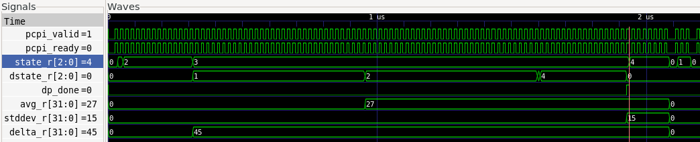

# SMACC: Statistical Math Accelerator for RISC-V

SMACC is a small coprocessor for the [PicoRV32](https://github.com/YosysHQ/picorv32)
RISC-V core that keeps running statistics over a stream of 32-bit samples:
min, max, count, average, standard deviation, and range (max - min). The CPU
drives it with four custom instructions over PicoRV32's PCPI coprocessor
interface.

It started as our final project for a System-on-Chip course in Fall 2024
(tagged `v1.0`) and we've kept coming back to it since. Compared to the
course version, the pipelined datapath is gone in favor of a bit-serial one
that's about a sixth of the size, STOP no longer stalls the CPU, and the
testbench and assertions are a lot more thorough.

In software on PicoRV32, every sample costs a couple of compares for
min/max, a 64-bit add, and a multiply for the sum of squares, and without
the M extension that multiply is a library call. With SMACC it's one
instruction per sample.

## Instructions

All four use the RISC-V custom-0 opcode (`0x0B`) and are told apart by
`funct3`. Bit-level encodings are in [docs/ISA_SPEC.md](docs/ISA_SPEC.md).

| Instruction | What it does                                            |
|-------------|---------------------------------------------------------|
| `START`     | Clear everything and start a new run                    |
| `DATA rs1`  | Add one 32-bit sample (1 cycle)                         |
| `STOP`      | Start computing avg/stddev/delta, returns right away    |
| `READ rd,n` | Read statistic `n` into `rd` (full 32 bits)             |

After STOP, avg/stddev/delta take a fixed 162 cycles in the background. The
CPU can poll the status flags or go do something else in the meantime.
Until they're done those three read as 0, so you can't get a stale or
half-computed value.

## Architecture

```plaintext
 ┌──────────┐   PCPI   ┌────────────┐
 │ PicoRV32 │ <──────> │ smacc_top  │  decode, READ mux
 └──────────┘          └─────┬──────┘
                             │
          ┌──────────────────┼──────────────────┐
          V                  V                  V
   ┌────────────┐     ┌────────────┐     ┌────────────────┐
   │ smacc_ctrl │     │ smacc_mem  │     │ smacc_datapath │
   │ FSM,       │     │ min, max,  │     │ avg, stddev,   │
   │ status,    │     │ count, sum,│     │ delta after    │
   │ errors     │     │ sum of sq  │     │ STOP, 162 cyc  │
   └────────────┘     └────────────┘     └────────────────┘
```

smacc_mem updates on every DATA in one cycle. smacc_datapath only runs
after STOP, using one bit-serial divider for both divides and a bit-serial
square root. More detail in [docs/DATAPATH_DESIGN.md](docs/DATAPATH_DESIGN.md).
A few things worth knowing:

- There's one multiplier in the design, the 32x32 squarer in smacc_mem. It
  has to be combinational because DATA is single-cycle, and its input is
  gated with DATA so it isn't toggling on every other instruction. avg^2 in
  the datapath is done with a shift-add while the second divide runs.
- Nothing wraps. The accumulators saturate and set a sticky error flag
  (overflow is just the carry-out of the accumulate add), and count/avg
  clamp at 2^32-1 when read.
- avg/stddev/delta are muxed to 0 unless the FSM is in DONE.
- Clean under Verilator `-Wall`, synchronous reset everywhere, no latches.

## Running the tests

Needs [Verilator](https://verilator.org) 5.x. [Yosys](https://yosyshq.net/yosys/)
and GTKWave are optional.

```sh
bash scripts/run_tests.sh           # lint + all 13 test groups (78 checks)
bash scripts/run_tests.sh --wave    # same, and dumps smacc_tb.vcd
yosys -s scripts/synth.ys           # synthesis + area report
```

## Verification and results

The testbench drives the PCPI bus directly. T1 through T12 check against
values worked out by hand (the math is in a comment next to each test), and
T13 checks 64 random samples against a software model. SVA in the RTL
covers the FSM, the PCPI handshake, and the divider. Test plan and full
output are in [docs/VERIFICATION.md](docs/VERIFICATION.md).

This is GTKWave around T1's STOP. STOP acks right away, the engine runs for
162 cycles while the CPU keeps polling status, and delta/avg/stddev
(45/27/15) are settled before the FSM gets to DONE. `state_r` is
2=ACCUMULATE, 3=FINALIZING, 4=DONE and `dstate_r` is 1=DIV1, 2=DIV2, 4=SQRT.



The tests cover zeros, 2^32-1, an accumulator overflow, and the random
run. Part of the output:

```plaintext
-- T12: sum-of-squares overflow --
[PASS] T12 error     = 16
[PASS] T12 min       = 4294967295
[PASS] T12 count     = 2

-- T13: 64 random samples vs reference model --
[PASS] T13 min       = 17693
[PASS] T13 max       = 16080600
[PASS] T13 avg       = 7990567
[PASS] T13 stddev    = 4497741
[PASS] T13 delta     = 16062907
...
*** ALL TESTS PASSED *** (2415 cycles)
```

Synthesis with Yosys 0.33, generic cells, SMACC only (the CPU isn't
included):

|                  | Original pipelined design | Current design |
|------------------|---------------------------|----------------|
| Generic cells    | ~77.8 K                   | ~12.2 K        |
| Flip-flops       | 1,010                     | 915            |
| Inferred latches | 0                         | 0              |

## Layout

```plaintext
src/rtl/      SMACC RTL, PicoRV32, and smacc_system.sv (CPU + SMACC)
src/tb/       Testbench
docs/         ISA spec, datapath design, verification
scripts/      Test and synthesis scripts
```

Docs: [ARCHITECTURE.md](ARCHITECTURE.md) (overview),
[docs/ISA_SPEC.md](docs/ISA_SPEC.md) (encodings, status flags, errors),
[docs/DATAPATH_DESIGN.md](docs/DATAPATH_DESIGN.md) (arithmetic and area),
[docs/VERIFICATION.md](docs/VERIFICATION.md) (tests and assertions).

## Authors

- **Marcos Garcia** ([@MarcosGrrcia](https://github.com/MarcosGrrcia))
- **Calvin L. Brown** ([@Cohbalt](https://github.com/Cohbalt))

Marcos is doing digital design and verification work after graduating.
Calvin is a GPU verification engineer at NVIDIA, and a lot of the
verification and cleanup in here comes from that.

## License

MIT, see [LICENSE](LICENSE). The bundled PicoRV32 core
([src/rtl/picorv32.v](src/rtl/picorv32.v)) is by Claire Xenia Wolf under the
ISC license.
